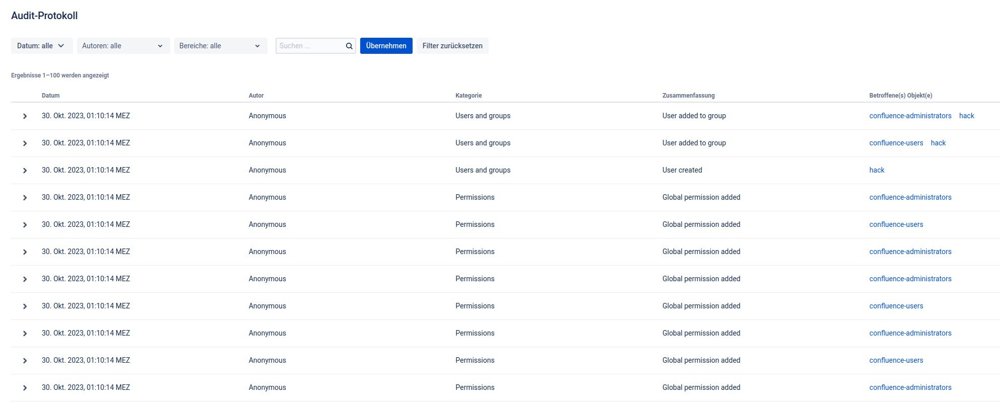
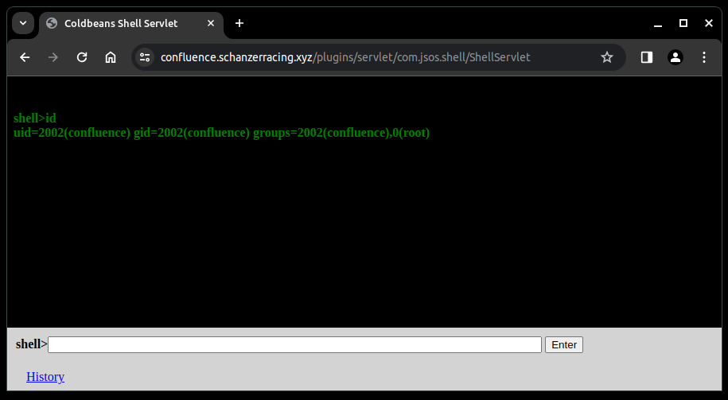

# Confluence Hack
CVE-2023-22515

## exploit.py
Exploit to create a new admin user \
Compromised audit log: \
 \
As a reverence served: https://packetstormsecurity.com/files/175225/Atlassian-Confluence-Unauthenticated-Remote-Code-Execution.html

## plugin_shellplug.jar
This plugin provides a web-based shell interface for executing command-line commands on a server \
You can install it from the Confluence web admin GUI \
Was found on a server that was live in production \

## ShellServlet.java
Is the decompiled file of plugin_shellplug.jar

## Tested on
- Confluence Server 8.5.1

## Disclaimer
This repository is provided for educational and informational purposes only. Use it responsibly and only on systems that you have permission to test. Unauthorized access to computer systems is illegal and unethical.
